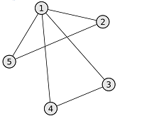
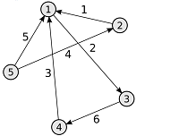
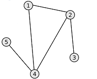
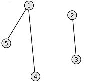
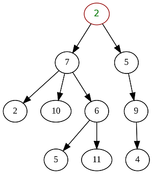

# Graphs
## Introduction

В данном проекте реализованы несколько основных алгоритмов на графах. Графы являются одной из базовых структур данных в программировании, которая используется повсеместно. В виде графов можно, например, интерпретировать схемы дорог, электрические цепи, географические карты, связи между людьми в социальных сетях и многое, многое другое.  

## Information

### Основные определения

**Граф** - это совокупность конечного множества вершин и множества ребер. Каждому ребру сопоставлены две точки из множества вершин графа, образующие граничные точки ребра.

**Виды графов по типу рёбер:**
* *неориентированный* - граф, в котором перемещение между вершинами, соединёнными ребром, возможно в любом направлении



* *ориентированный* - граф, рёбрам которого присвоено направление. Направленные рёбра именуются также дугами. Перемещение из одной вершины в другую возможно только по дугам соответствующего направления


Если помимо наличия ребра между двумя вершинами, задан ещё и вес ребра, то такой граф называется ***взвешенным***




**Виды графов по числу рёбер:**
* *нулевой* - в графе отсутствуют рёбра


* *неполный* - в графе есть рёбра, но не из каждой вершины есть ребро в любую другую вершину


* *полный* - в графе из каждой вершины есть ребро в любую другую вершину


**Виды графов по достижимости узлов:**
* *связный* - для любой вершины в графе есть хотя бы один путь до любой другой вершины в этом же графе



* *несвязный* - в графе отсутствует путь хотя бы между двумя его вершинами



Для ориентированных графов дополнительно разделяют ещё два типа связности: *сильносвязный* и *слабосвязный*.
* *сильносвязный* - для любой вершины в ориентированном графе существует путь в любую другую вершину и обратно.
* *слабосвязный* - между двумя любыми вершинами в графе существует путь, но этот путь может быть односторонним. Т.е. из вершины А в вершину B путь может существовать, а обратно нет.

**Деревья**

Отдельным важным подтипом графов являются *деревья*. \
***Дерево*** - это связный ациклический граф, в котором любые две вершины соединены лишь одним маршрутом. Для любого дерева справедлива следующая формула: *q = n - 1*, где q - это число рёбер, n - число вершин графа (дерева). Деревья могут быть построены на базе как неориентированных графов, так и ориентированных, в зависимости от решаемой задачи.



### Способы задания графа

Существуют следующие основные способы задания графов:
* *матрица смежности* - квадратная матрица, размерность которой равна числу вершин в графе, и в которой $`A_{ij}`$ элемент матрицы содержит в себе информацию о ребре из вершины $`i`$ в вершину $`j`$. Возможные значения, которые может принимать $`A_{ij}`$:
    + для невзвешенного неориентированного графа: 
        - 0 - ребра между вершинами нет
        - 1 - ребро между вершинами есть  
    + для взвешенного неориентированного графа: 
        - 0 - ребра между вершинами нет 
        - N - ребро между вершинами есть, и его вес равен N 
    + для невзвешенного ориентированного графа: 
        - 0 - дуги между вершинами нет
        - 1 - есть дуга (ориентированное ребро), которая направлена из вершины $`i`$ в вершину $`j`$
    + для взвешенного ориентированного графа: 
        - 0 - дуги между вершинами нет
        - N - есть дуга (ориентированное ребро), которая направлена из вершины $`i`$ в вершину $`j`$, и её вес равен N
* *матрица инцидентности* - это матрица, количество строк в которой соответствует числу вершин, а количество столбцов – числу рёбер. В ней указываются связи между инцидентными элементами графа (ребро (дуга) и вершина). В неориентированном графе если вершина инцидентна ребру, то соответствующий элемент равен 1, в противном случае элемент равен 0. В ориентированном графе если ребро выходит из вершины, то соответствующий элемент равен 1, если ребро входит в вершину, то соответствующий элемент равен -1, если ребро отсутствует, то элемент равен 0.


Если количество ребер графа по сравнению с количеством вершин невелико, то значения большинства элементов матрицы смежности будут равны 0. При этом использование данного метода нецелесообразно. Для подобных графов имеются более оптимальные способы их представления:

* *список смежности* - один из способов представления графа в виде коллекции списков вершин. Каждой вершине графа соответствует список, состоящий из «соседей» (т.е. из вершин, которые непосредственно достижимы напрямую из текущей вершины) этой вершины с указанием весов рёбер.
* *список рёбер* - таблица (матрица размерность Nx3), в каждой строке которой записаны две смежные вершины и вес, соединяющего их ребра.


## Правила обработки графов в данной программе

- Веса ребер только натуральными числами
- Могут быть петли
- Веса могут отличаться на всех ребрах
- Только ненулевой связный граф

Библиотека _s21_graph.h_:
* Разработана на языке С++ стандарта C++17
* Google Style
* Библиотека представлена в виде класса `Graph`, который хранит в себе информацию о графе с помощью **матрицы смежности**.
* Сборка программы настроена с помощью Makefile
* Класс `Graph` содержит в себе следующие публичные методы:
    + `LoadGraphFromFile(string filename)` - загрузка графа из файла в формате матрицы смежности
    + `ExportGraphToDot(string filename)` - выгрузка графа в файл в формате dot

Библиотека _s21_graph_algorithms.h_
* Разработана на языке С++ стандарта C++17
* Библиотека представлена в виде класса `GraphAlgorithms`, который содержит в себе реализацию алгоритмов на графах. При этом сам класс `GraphAlgorithms` не знает о внутреннем представлении графа из класса `Graph`.
* Класс `GraphAlgorithms` содержит в себе следующие публичные методы:    
    + `DepthFirstSearch(Graph &graph, int start_vertex)` - *нерекурентный* поиск в глубину в графе от заданной вершины. Функция возвращает массив, содержащий в себе обойдённые вершины в порядке их обхода.
    + `BreadthFirstSearch(Graph &graph, int start_vertex)` - поиск в ширину в графе от заданной вершины. Функция возвращает массив, содержащий в себе обойдённые вершины в порядке их обхода.
    + `GetShortestPathBetweenVertices(Graph &graph, int vertex1, int vertex2)` - поиск кратчайшего пути между двумя вершинами в графе с использованием *алгоритма Дейкстры*. Функция принимает на вход номера двух вершин и возвращает численный результат, равный наименьшему расстоянию между ними
    + `GetShortestPathsBetweenAllVertices(Graph &graph)` - поиск кратчайших путей между всеми парами вершин в графе с использованием *алгоритма Флойда-Уоршелла*. В качестве результата функция возвращает матрицу кратчайших путей между всеми вершинами графа
    + `GetLeastSpanningTree(Graph &graph)` - поиск наименьшего остовного дерева в графе с помощью *алгоритма Прима*. В качестве результата функция возвращает матрицу смежности для минимального остовного дерева
    + `SolveTravelingSalesmanProblem(Graph &graph)` - решение задачи коммивояжера с помощью *муравьиного алгоритма*. Находит самый выгодный (короткий) маршрут, проходящий через все вершины графа хотя бы по одному разу с последующим возвратом в исходную вершину. В качестве результата функция возвращает структуру `TsmResult`, описанную ниже:
    ```cpp
    struct TsmResult {
        std::vector<int> vertices;
        double distance;
    }
    ``` 

*Если при заданном графе решение задачи невозможно, выводит ошибку.*

## Консольный интерфейс

* Консольный интерфейс покрывает следующий функционал:
    1. загрузка исходного графа из файла
    2. обход графа в ширину с выводом результата обхода в консоль
    3. обход графа в глубину с выводом результата обхода в консоль
    4. поиск кратчайшего пути между произвольными двумя вершинами с выводом результата в консоль
    5. поиск кратчайших путей между всеми парами вершин в графе с выводом результирующей матрицы в консоль
    6. поиск минимального остовного дерева в графе с выводом результирующей матрицы смежности в консоль
    7. решение задачи комивояжера с выводом результирующего маршрута и его длины в консоль

*При разработке использовался паттерн MVC
